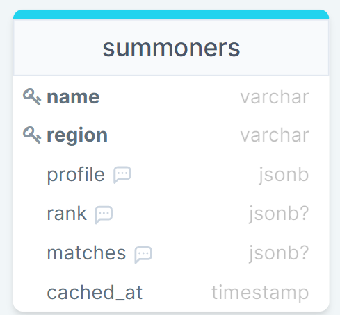

***
# Trackrrr-Backend ([website](https://trackrrr-backend.herokuapp.com/))
***

**This is the backend for Trackrrr: an app that uses the Riot Games API to allow users to search for a username and view that user's in-game stats. 
Right now, Trackrrr only supports League of Legends, but it will also be adding more games like Valorant and TFT soon.**

### Trackrrr allows you to search for a user by region (server) and summoner name. If found, this is what can be viewed about the user:

1. Overview  
  a) Profile icon  
  b) Summoner level  
  c) Summoner name  
2. Ranks (Solo / Flex)  
  a) Current rank & border  
  b) League points (LP)  
  c) Wins / Losses  
  d) Win Ratio
3. Matches (for each Solo / Flex match)  
  a) Game creation date  
  b) Victory / Defeat  
  c) Game duration  
  d) Champ name & image  
  e) Summoner spells  
  f) Summoner runes  
  g) KDA (Kills / Deaths / Assists)  
  h) CS count  
  i) Champ level  
  j) Items  
  k) Participants (Champ image and Summoner name for each)

### There are only two backend routes:

1. summoners/:region/:summonerName:  
Checks for the summoner in the DB first. If cached, return the summoner JSON from the DB. 
If not, retrieve the summoner from the Riot Games API, cache it, and then return the summoner JSON.

2. summoners/:region/:summonerName/update:  
Directly fetches the summoner from the Riot Games API, recaches the summoner in the DB and then returns the summoner JSON. 
This route is used for when an update to the cached user is needed.

### Important Note

The app is scheduled to delete any matches data that has been cached in the DB for longer than 7 days.
The app is also scheduled to delete any cached users that have been cached in the DB for longer than 14 days.

### Installation:

1. Clone this github repo => `git clone https://github.com/mostafa4460/trackrrr-backend.git`
2. Install dependencies => `npm install`
3. Set these system environments: 
  * PORT (port you want your web server to run on)
  * DATABASE_URL2 (name of your local database - use "trackrrr")
  * NODE_ENV (node environment - should be "development")
  * API_KEY (Riot Games API key - need to signup through their portal to retrieve this)
4. Create and seed your local database => `psql < trackrrr.sql`
5. Start your server => `npm start`
6. To run your tests, change the NODE_ENV env to "test" => `jest`

### Data Models:

## Technologies Used:
**Node.js (need to install it)  
Express  
Postgres (need to install it)  
Jest  
Riot Games API**
